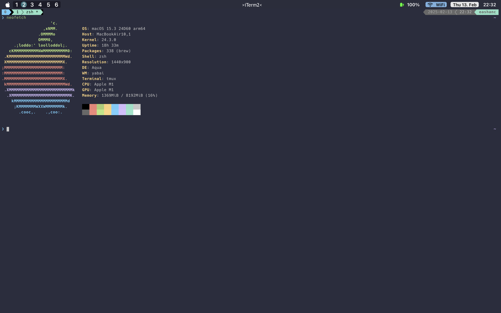

<h1>My MacOS Dotfiles 🖥️</h1>

What are dotfiles?
Dotfiles are configuration files for Unix systems. They're used to store settings/preferences for command line tools, applications, and services, and are especially used to customize the behavior/appearance of the user's environment.

These are the dotfiles for my setup.

Below are references to the tools that I use.

<b>Terminal Emulator:</b> <a href=https://iterm2.com>iTerm2</a>

<b>Window Manager:</b> <a href=https://github.com/koekeishiya/yabai>Yabai</a>

<b>Custom keybindings:</b> <a href=https://github.com/koekeishiya/skhd>Skhd<a>

<b>Top menu/status bar</b> <a href=https://github.com/FelixKratz/SketchyBar> Sketchybar </a>

<b>IDEs/Editors:</b> <a href=https://neovim.io> Neovim (nvim) </a>

<b>ZSH framework + zsh theme:</b> <a href=https://github.com/ohmyzsh/ohmyzsh> Oh-my-zsh </a>

<b>Process viewer/Activity monitor:</b> <a href=https://clementtsang.github.io/bottom/stable/> btm </a>

All of the above listed tools can be installed using homebrew.

Below are some screenshots of how my configuration looks in daily usage.

 

 
 

